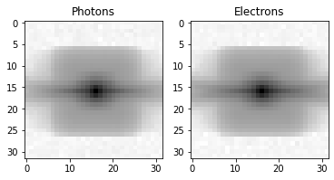
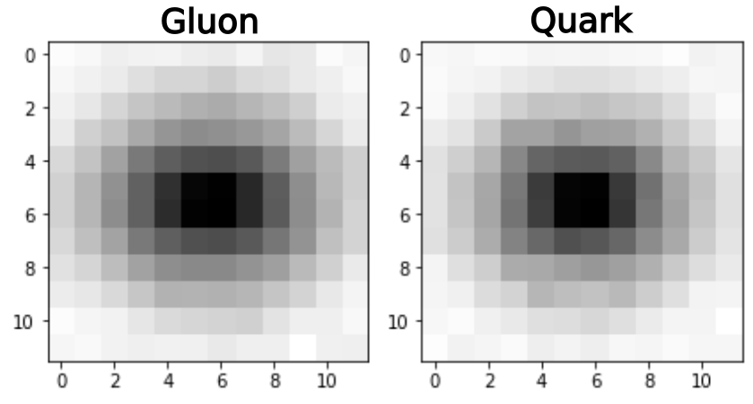
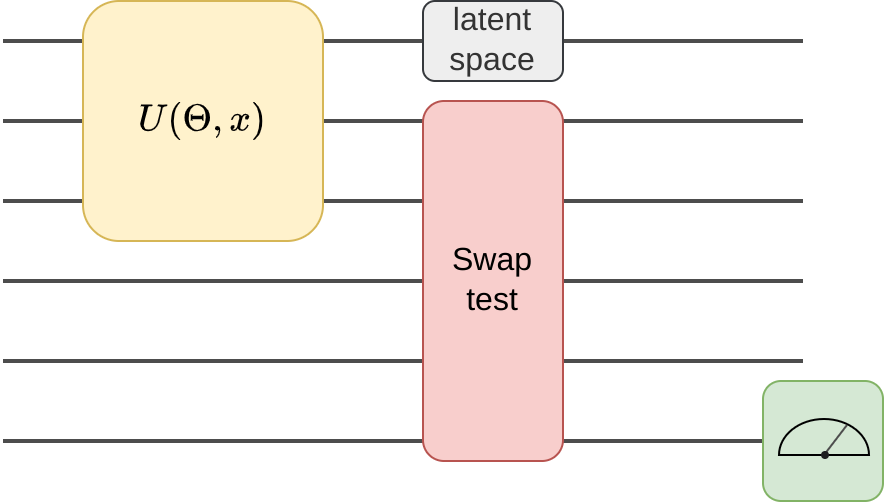

# Quantum Autoencoders for HEP Analysis at the LHC

The code for the [QAE GSoC project](https://summerofcode.withgoogle.com/programs/2022/projects/ePnjKlJs). The original repo can be found [here](https://github.com/TomMago/hep-VQAE). In addition, more details can be found in my [post about the project](https://www.tommago.com/posts/gsoc/).
A big thank you to Sergei Gleyzer for the supervision and support.

## Contents

- [Setup](#Setup)
- [Project](#Project)
  - [Datasets](#Datasets)
    - [MNIST](#MNIST)
    - [Electron Photon](#Electron-Photon)
    - [Quark Gluon](#Quark-Gluon)
  - [Models](#Models)
    - [Fully Quantum Autoencoder](#Fully-Quantum-Autoencoder)
    - [Hybrid Quantum Autoencoder](#Hybrid-Quantum-Autoencoder)
  - [Results](#Resutls)
- [Code](#Code-structure)
  - [Structure](#Code-structure)
  - [Training](#Training)
- [References](#References)

## Setup

The most convenient way to set up the code is to create an environment

``` shell
conda create --name tfq
conda activate tfq
```

and install the requirements with

``` shell
pip install -r requirements.txt
```

Afterwards, you can install the hep_VQAE package in development mode (execute in repo root)
``` shell
python -m pip install -e .
```

and import the kernel to jupyter 

``` shell
python -m ipykernel install --user --name tfq
```

If you want to use lightning.gpu as simulation backend for pennylane also install the plugin and cuQuantum with

``` shell
pip install pennylane-lightning[gpu] cuquantum-python
```

`

## Project

The goal of the project was to develop a Quantum Autoencoder (QAE) for anomaly detection in LHC data. Such an Autoencoder could be trained on Standard Model (SM) data and try to spot anomalous signals of Beyond the Standard Model (BSM) physics in datasets produced at the LHC.

### Datasets

Throughout the project I worked with different datasets:

#### MNIST

I used MNIST images as a first validation of ideas and for debugging code samples.

#### Electron Photon 

The Electron Photon dataset contains 32x32 ECAL images of electrons and photons.



#### Quark Gluon

The Quark Gluon dataset was my main object of study. It contains Tracks, ECAL and HCAL images for Quark and Gluon-initiated jets respectively. For the most part, I rescaled the data to 12x12 in order to be able to simulate the demanding quantum algorithms and only used the ECAL channel. I included a little script to rescale the original data in the notebooks folder. If you want to get access to the dataset feel free to [contact me](mailto:tommagorsch@gmail.com) or someone from [ML4SCI](https://ml4sci.org/gsoc/2021/mentors.html).



An interesting feature of this dataset is the different complexity of the two jets. Since Gluon-initiated jets display a larger intrinsic dimensionality, a classical CNN can only spot them as anomalies when trained on the Quark jets. However, it does not work the other way around, so a CNN autoencoder trained on the Gluon jets won't spot the Quark jet anomalies, as it learned to reconstruct the "more challenging" Gluon jets. For more details on this check out the [blog post](https://www.tommago.com/posts/gsoc/). 

### Models

In my project, I implemented and tried many different architectures.
However, my main focus was on the two following:

#### Fully Quantum Autoencoder

The fully Quantum Autoencoder (I abbreviate it as SQAE - Simple Quantum AutoEncoder) is based on [[1]](##References) and [[2]](##References).
The SQAE is structured as follows:



The classical data is encoded with some unitarity and a parametrized unitarity is applied.
A SWAP-test computes the fidelity between the non-latent qubits and some trash qubits, which is then measured at the readout bit.

The SQAE is trained by maximizing the fidelity between non-latent qubits and trash qubits. Because the transformation $U$ is unitary the decoder is simply the adjoint of the encoder. A more detailed description of why the fidelity with the trash qubits can be used as loss can be found [here](https://www.tommago.com/posts/qae/). 

#### Hybrid Quantum Autoencoder

As a second approach, I wanted to try a hybrid architecture, to combine QML with the strength of classical Deep learning. In particular, I wanted to use classical CNNs to reduce the dimension of the data before feeding it into a PQC. Schematically the Hybrid Autoencoder (HAE) looks like this:


The HAE is optimized using a classical reconstruction loss.

### Results

Up until now I achived the following results when training on the 12x12 Quark images and tagging the Gluons

| Model              | Parameters | Test AUC |
|--------------------|------------|----------|
| Classical CNN      | 3200       | 60%      |
| Fully quantum SQAE | 576        | 56.5%    |
| Hybrid AE          | 3423       | 57.5%    |

However I was not able to train the Hybrid model to convergence since the simulation was too demanding.
So I'm curious to see what results we can get when training with more sophisticated hardware.
In addition I have some updates to the SQAE architecture which might change the results.
In general the 12x12 dataset is not optimal for testing, since when scaling down to such a small size, there is quite a lot of information loss. A more detailed discussion of the results can be found in the [post](https://www.tommago.com/posts/gsoc/). 

## Code

### Structure

- **data**:  
The notebooks expect the respective data to be stored in the data directory.

- **hep_VQAE**:  
The main code can be found in the package hep_VQAE. There are implementations for the purely quantum autoencoder in pennylane and tf-quantum.
Furthermore, there are classical and hybrid models as well as auxiliary functions for data preprocessing and evaluation.
    
- **notebooks**:  
The notebooks folder contains example applications of the different models to the datasets. These notebooks are commented to walk through the training.

- **dev_notebooks**:  
The dev_notebooks folder on the other hand contains a lot of code and experiments I conducted throughout the project. There are experiments with classical Autoencoders, Jax implementations, vision transformers, different experiments with quantum convolutional circuits, and much more. However this code is less documented, but I wanted to include it, maybe there is something someone might find useful in the future.

### Training

Training these quantum models can take quite some time, as the circuit simulations are very demanding.
I therefore recommend using [pennylane](https://pennylane.ai) with the [lightning.gpu](https://github.com/PennyLaneAI/pennylane-lightning-gpu) plugin as backend. lightning.gpu is built on NVIDIAs new [cuQuantum](https://github.com/NVIDIA/cuQuantum) simulation framework and provides fast simulation on GPUs.
However note, that cuQuantum only supports newer GPUs.
In addition, to differentiate in the simulations it is recommended to use the adjoint differentiation method as it is the fastest.
Adjoint differentiation is supported by lightning.gpu, however, make sure that you have a GPU with sufficient memory, as depending on the model this can be a constraint.

## References

[1] Romero, J., Olson, J. P., & Aspuru-Guzik, A. (2017). Quantum autoencoders for efficient compression of quantum data. Quantum Science and Technology, 2(4), 045001.

[2] Ngairangbam, V. S., Spannowsky, M., & Takeuchi, M. (2022). Anomaly detection in high-energy physics using a quantum autoencoder. Physical Review D, 105(9), 095004.


