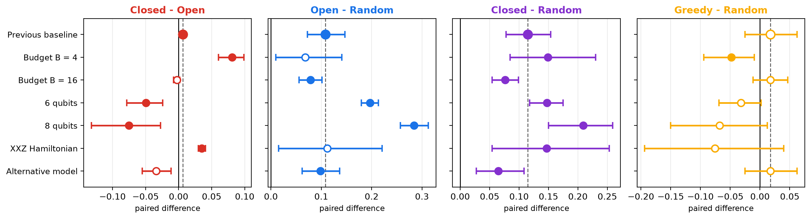

# Quantum Circuit Design with LLMs

**When does language-model reasoning actually help variational quantum circuit architecture search?**

| | |
|---|---|
| **Contributor** | Tomoya Hatanaka ([@dorakingx](https://github.com/dorakingx)) |
| **Program** | Google Summer of Code 2026 |
| **Organization / project** | [ML4SCI](https://ml4sci.org/) · QMLHEP (project slot QMLHEP16) |
| **Mentors** | Marco Knipfer, Jogi Suda Neto, Konstantin Matchev, Katia Matcheva |
| **Final report** | [`GSoC2026_FINAL_REPORT.md`](./GSoC2026_FINAL_REPORT.md) |
| **Development repository** | https://github.com/dorakingx/llm-vqc (canonical; full history) |
| **Snapshot of** | `dorakingx/llm-vqc` tag [`gsoc-2026-final`](https://github.com/dorakingx/llm-vqc/tree/gsoc-2026-final) (commit `aadcd26`) |

This folder is a **self-contained snapshot** of the GSoC 2026 work product. Everything
needed to install the package, run the test suite and regenerate every reported table,
statistic and figure **without any API key** is included here. Development continues in
[`dorakingx/llm-vqc`](https://github.com/dorakingx/llm-vqc), which also holds the
superseded research lines and full Git history (see [What is not included](#what-is-not-included)).

---

## Motivation

A variational quantum circuit (VQC) is a parameterised circuit whose angles are trained by a
classical optimizer. Its *architecture* — which gates, on which qubits, in which order — is
discrete and must be **searched** (quantum architecture search, QAS). Every candidate must
be trained before it can be scored, so search budgets are small, and good architectures
depend on the physics of the target problem.

That last point is the opening for a large language model (LLM): it has read the physics
literature and may carry a useful **semantic prior** over circuit structure. Earlier work,
including the mentoring group's *AI Agents for Variational Quantum Circuit Design*
([arXiv:2602.19387](https://arxiv.org/abs/2602.19387)), shows that an LLM *can* design VQCs,
but evaluates this qualitatively — single runs, no random or evolutionary baselines, no seed
replication, no statistical tests.

This project therefore asks an **evaluative** question:

> Under a **budget-matched, capacity-controlled, protocol-frozen** comparison against
> non-semantic search, does an LLM's semantic prior buy better circuit architectures — and
> does iterative feedback add anything on top of it?

## Headline result

On a quantum-autoencoder (QAE) task for spin-chain ground states, with every method given
the same candidate budget, the same circuit capacity and the same trainer:

- **The LLM's score-free semantic prior is a robust advantage.** LLM-Open (one batch of
  proposals, generated before any score is seen) beats Random search in **6/6** varied
  conditions, significantly in 4/6, and most strongly where the problem is hardest
  (**+0.284** held-out trash fidelity at 8 qubits, `dz = 5.55`, 12/12 seeds).
- **The iterative feedback loop is not.** LLM-Closed beats LLM-Open in only **2/6**
  conditions and significantly **reverses** at 6 and 8 qubits.
- **Greedy − Random is significant in 0/6**, so the gain is attributable to the semantic
  prior, not merely to refining a good candidate.
- **Resource-contract compliance is a real failure mode:** the share of LLM proposals that
  satisfy the exact gate contract falls to **65.1%** with the weaker model.

No claim of quantum advantage or of general LLM superiority is made.



*Paired per-seed differences (12 seeds, bootstrap 95% CI) for the four pre-declared
contrasts in each condition; filled markers: exact two-sided Wilcoxon p < 0.05; dashed line: reference condition.*

Selected-architecture means (held-out test trash fidelity, 12 paired seeds per cell):

| Condition | Random | Greedy | LLM-Open | LLM-Closed |
|---|---:|---:|---:|---:|
| Reference (4 qubits, TFIM, B = 8, `gpt-5.4-mini`) | 0.8520 | 0.8696 | 0.9605 | **0.9671** |
| Budget B = 4 | 0.8001 | 0.7520 | 0.8682 | **0.9494** |
| Budget B = 16 | 0.8893 | 0.9069 | **0.9681** | 0.9659 |
| 6 qubits | 0.7254 | 0.6936 | **0.9222** | 0.8728 |
| 8 qubits | 0.5924 | 0.5245 | **0.8765** | 0.8013 |
| XXZ Heisenberg chain | 0.8094 | 0.7338 | 0.9215 | **0.9563** |
| Alternative model (`gpt-4.1-mini`) | 0.8520 | 0.8696 | **0.9503** | 0.9166 |

Full statistics, the supporting minimum-budget study, negative results and limitations:
[final report §5](./GSoC2026_FINAL_REPORT.md#5-main-results) and
[`outputs/qae_robustness/REPORT.md`](./outputs/qae_robustness/REPORT.md).

---

## What was implemented

- **Circuit IR with an exact capacity contract** ([`llm_vqc/ir/`](./llm_vqc/ir)) — every
  candidate from every method has identical width, gate set and trainable-parameter count
  (3 rotations + 1 CNOT per qubit), verified per candidate, so no method can win by
  proposing a bigger circuit.
- **Deterministic shared trainer/evaluator** ([`llm_vqc/evaluation/`](./llm_vqc/evaluation))
  — Adam, fixed schedule, training seed derived from `(seed, architecture-hash)`; selection
  and feedback read **validation only**, the test split is read once after selection.
- **Budget-matched search arms** ([`llm_vqc/search/`](./llm_vqc/search),
  [`llm_vqc/experiments/qae_robustness/arms.py`](./llm_vqc/experiments/qae_robustness/arms.py))
  — Random, Greedy, Evolutionary, **LLM open-loop** and **LLM closed-loop**.
- **LLM API layer with hard cost control** ([`llm_vqc/llm/`](./llm_vqc/llm)) — OpenAI
  structured outputs, version-pinned model snapshots, bounded JSON/capacity repair with a
  flagged random fallback, a persistent spend ledger, and a refusal to make any paid call
  unless `LLM_API_BUDGET_USD` is set to an explicit nonzero cap.
- **Protocol freezing and manifest fingerprinting**
  ([`llm_vqc/experiments/qae_robustness/manifest.py`](./llm_vqc/experiments/qae_robustness/manifest.py))
  — each study's protocol was committed before execution, and a test asserts that every
  condition differs from the reference in **exactly one** factor.
- **Paired statistics, figure, report and deck builders** ([`scripts/qae/`](./scripts/qae))
  — bootstrap CIs, exact Wilcoxon, sign test, Cohen's `dz`, win counts.
- **603 tests** across 53 test modules ([`tests/`](./tests)), runnable offline.
- **Origin tooling** — the project began as an LLM agent that explores Clifford-circuit
  equivalence classes by BFS with phase-normalised statevector hashing
  ([`llm_vqc/circuit_explorer.py`](./llm_vqc/circuit_explorer.py),
  [`llm_vqc/agent.py`](./llm_vqc/agent.py)). It still works and is retained, but it is not
  the final scientific contribution.

## Folder structure

```
Quantum_Circuit_Design_with_LLMs_Tomoya_Hatanaka/
├── README.md                    # this file
├── GSoC2026_FINAL_REPORT.md     # ★ GSoC 2026 final report
├── llm_vqc/                     # Python package
│   ├── experiments/
│   │   ├── qae_robustness/      # ★ primary study: arms, prompts, manifest, study driver
│   │   ├── qae_budget_targets/  #   supporting minimum-budget-to-target study
│   │   ├── qae_tfim/            #   QAE v2 → v5 lineage (v5 = primary study's reference cell)
│   │   └── capacity_controlled/ #   earlier T1/T2 capacity-controlled benchmarks
│   ├── ir/  evaluation/  search/  llm/  tasks/  diagnostics/
│   └── circuit_explorer.py, agent.py, visualization.py, main.py   # origin Clifford-BFS tool
├── scripts/
│   ├── check.sh                 # ruff + full pytest suite (no API key, no network)
│   ├── qae/                     # study runners, analysis, figure/report/deck builders
│   └── smoke_*.py               # offline end-to-end smoke workflows
├── tests/                       # 603 tests (+ fixtures)
├── configs/                     # smoke/example run configs
├── outputs/                     # committed result artifacts of the final studies
│   ├── qae_robustness/          # ★ primary study: per-condition logs, tables, figures, deck
│   ├── qae_budget_targets_v2_20260908/  # supporting study: audit, figures, deck, file hashes
│   └── qae_tfim_neutral_v5/     # reference cell reused bit-for-bit by the primary study
├── docs/
│   ├── research/                # frozen protocols (QAE_ROBUSTNESS_PROTOCOL.md, …), roadmap
│   └── research-log.md
├── paper/                       # LaTeX manuscript (main.tex, references.bib)
├── DECISIONS.md                 # phase-by-phase design decisions and gates
├── LLM-VQC_MASTER_PLAN.md       # original research design
├── pyproject.toml, requirements.txt, requirements-lock.txt
└── .env.example                 # template only — never commit a real .env
```

---

## Installation

All commands below are run **from inside this folder**.

```bash
git clone https://github.com/ML4SCI/QMLHEP.git
cd QMLHEP/Quantum_Circuit_Design_with_LLMs_Tomoya_Hatanaka

python -m venv .venv
source .venv/bin/activate          # Windows: .venv\Scripts\activate
pip install -e ".[dev]"            # package + pytest + ruff
```

Python ≥ 3.10 is required. The snapshot was verified with Python 3.12 (macOS arm64); the
source repository's CI also verifies Python 3.12 on Ubuntu and the original development
used Python 3.14. For an exact environment, `requirements-lock.txt` pins every package
version of the verified Python 3.12 environment:

```bash
pip install -r requirements-lock.txt
pip install -e . --no-deps
```

Only CPU is used; no GPU or CUDA toolkit is needed.

## Running the tests

```bash
./scripts/check.sh                 # ruff check . && pytest tests/ -q
python -m pytest tests/ -q         # test suite on its own
```

Expected: `All checks passed!` and **`603 passed`** (about 2–3 minutes). The suite needs **no
API key and makes no network calls**; every LLM code path is tested against mocked providers
or committed logs.

## Minimal reproduction (no API key, no cost)

Every table, statistic and figure in the final report is regenerated from the committed
artifacts in `outputs/`, with **zero** model calls:

```bash
# Primary study — figures, report, tested one-factor slice figures
python scripts/qae/build_qae_robustness_figures.py
python scripts/qae/build_qae_robustness_report.py
python scripts/qae/build_qae_robustness_slice_figures.py

# Supporting study — validation-only re-analysis of the committed candidate logs
python scripts/qae/analyze_budget_targets.py \
  --root outputs/qae_robustness \
  --out outputs/qae_budget_targets_v2_20260908/audit \
  --extra-condition target_tfim_b6:6:all:outputs/qae_budget_targets_v2_20260908 \
  --extra-condition target_xxz_b10:10:LLM-Closed:outputs/qae_budget_targets_v2_20260908
python scripts/qae/build_budget_target_figures.py \
  --audit outputs/qae_budget_targets_v2_20260908/audit

# Reference cell (v5) figures
python scripts/qae/build_qae_v5_figures.py
```

These commands overwrite files under `outputs/`; use `git diff --stat` afterwards to compare
with the committed versions and `git checkout -- outputs` to restore them.

Re-running the non-LLM search arms from scratch (deterministic, no API, ~30 s):

```bash
python scripts/qae/run_qae_tfim_neutral_v5.py --no-api --output /tmp/v5_noapi
```

Other offline checks:

```bash
python scripts/qae/run_qae_robustness.py --list                  # the 7 conditions
python scripts/qae/run_qae_robustness.py --estimate --conditions all   # cost upper bound, no calls
python scripts/qae/run_budget_target.py --list --estimate --status
python scripts/qae/run_budget_target.py --cells all --reuse-only # rebuild cells from stored logs
python scripts/smoke_search_comparison.py configs/search_smoke.yaml  # all arms, mock LLM
python -c "from llm_vqc import explore_circuit_space; print(explore_circuit_space(num_qubits=3, max_depth=5)['total_unique_states'])"   # 666
```

## LLM / API requirements

| What | Needs a paid API? |
|---|---|
| Installing, `./scripts/check.sh`, the full test suite | **No** |
| Everything in [Minimal reproduction](#minimal-reproduction-no-api-key-no-cost) | **No** |
| Random / Greedy / Evolutionary arms (`--no-api`) | **No** |
| Re-generating LLM-Open / LLM-Closed candidate pools from scratch | **Yes — OpenAI API** |
| The origin Clifford-BFS agent CLI (`llm-vqc`) | **Yes — OpenAI API** |

> ⚠ **The commands below call the OpenAI API and will spend money.** They are only needed to
> regenerate raw LLM candidate pools; all reported results are already reproducible without
> them.

```bash
cp .env.example .env               # put your own OPENAI_API_KEY in .env — never commit it
export LLM_API_BUDGET_USD=5.00     # REQUIRED hard cap; paid calls are refused without it

python scripts/qae/run_qae_robustness.py --estimate --conditions all   # dry run, no calls
python scripts/qae/run_qae_robustness.py --conditions all              # resumable
LLM_API_BUDGET_USD=2.00 python scripts/qae/run_budget_target.py --cells all
```

Models are version-pinned snapshots: `gpt-5.4-mini-2026-03-17` (reference) and
`gpt-4.1-mini-2025-04-14` (alternative model). Recorded usage: the robustness study made 511
calls (428,651 input / 225,577 output tokens); the budget-target study made 138 calls
(USD 0.29 at list price). Stored LLM outputs are **reused, not re-paid**, when budget, model
snapshot, prompt, seed and data all match.

## Reproducibility notes

- **Protocols were frozen and committed to Git before execution** (in the development
  repository's history): [`docs/research/QAE_ROBUSTNESS_PROTOCOL.md`](./docs/research/QAE_ROBUSTNESS_PROTOCOL.md)
  and [`docs/research/QAE_BUDGET_TARGET_PROTOCOL.md`](./docs/research/QAE_BUDGET_TARGET_PROTOCOL.md).
  No external preregistration registry was used.
- **Committed logs are the source of truth.** Raw per-candidate results, LLM proposal pools
  and per-call provenance for every condition are in `outputs/`, so every number survives the
  loss of API access.
- **Verified for this snapshot** (fresh Python 3.12 venv, no API key present):
  - `./scripts/check.sh` → ruff clean, **603 passed**;
  - re-running the v5 Random and Greedy arms from scratch reproduces every committed loss and
    fidelity value **exactly** (max absolute difference 0.0);
  - the budget-target audit reproduces every attainment count and every CSV unchanged. Its
    two `run_record.json` copies differ only in wall-clock metadata, as documented in the
    final report §8;
  - regenerated figures are pixel-identical to the committed ones except for embedded
    metadata (creation date, Matplotlib version); three PNGs differ by a single pixel of
    canvas height, which comes from the local font/Matplotlib build.
- `outputs/qae_budget_targets_v2_20260908/file_hashes.json` pins SHA-256 hashes of that
  study's artifacts, including the analysis script copied into `audit/`; do not reformat
  those files.
- Data are **generated locally** (TFIM and XXZ ground states by exact diagonalisation); no
  external dataset is downloaded or redistributed. Simulation is noiseless state-vector.

## What is not included

To keep this snapshot small and focused on the final results, the following remain **only**
in the [development repository](https://github.com/dorakingx/llm-vqc/tree/gsoc-2026-final):

- `archive/` — read-only copies of superseded research lines (HIGGS task qualification,
  blocked `bench_v2`, free-amplitude and mini-demo lines), about 29 MB;
- superseded result packages — capacity-controlled T1/T2 benchmarks, QAE v2–v4 and early
  pilot outputs (the code that produced them *is* included);
- earlier deck drafts and the July 2026 presentation packages (`docs/presentation/`);
- the source repository's GitHub Actions workflows and a stale `uv.lock`;
- all secrets, `.env` files, virtual environments and caches (none were ever committed).

## Citation and further material

- Final report: [`GSoC2026_FINAL_REPORT.md`](./GSoC2026_FINAL_REPORT.md)
- Manuscript: [`paper/main.tex`](./paper/main.tex), [`paper/references.bib`](./paper/references.bib)
- Development repository and full history: https://github.com/dorakingx/llm-vqc
- Immutable GSoC snapshot: https://github.com/dorakingx/llm-vqc/tree/gsoc-2026-final

**Licence.** No licence has been chosen for this work yet; the licence is awaiting ML4SCI /
mentor confirmation (final report §13). Third-party dependencies are used unmodified under
their own licences, and none is vendored.
