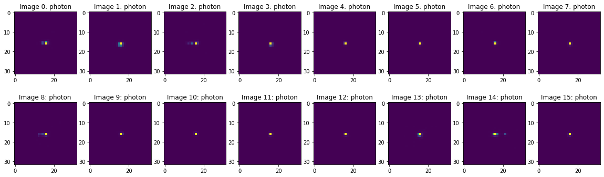
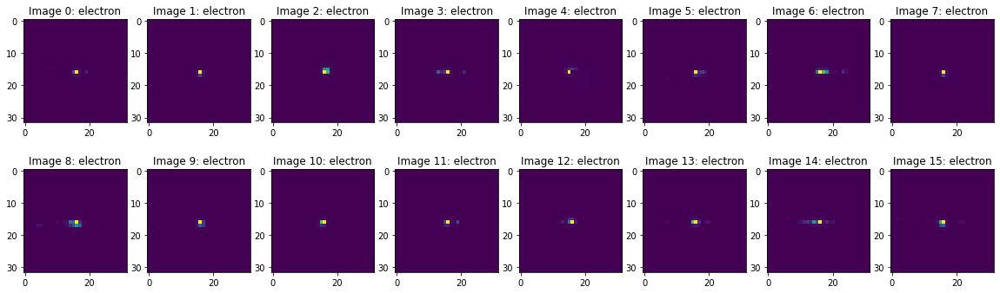
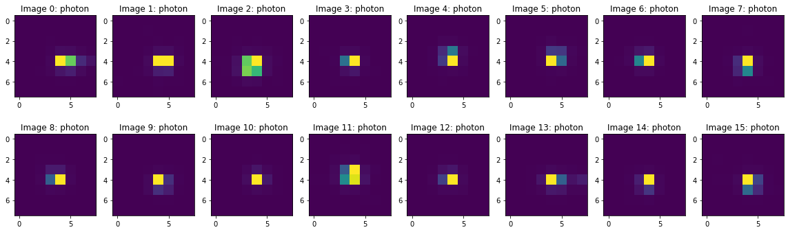
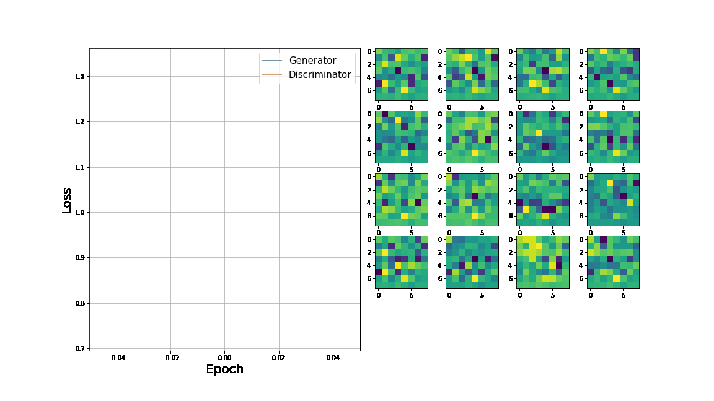

This is a cloned repository for the ML4Sci archive. The main repository for this project can be found [here](https://gitlab.cern.ch/clcheng/quple).

[](https://opensource.org/licenses/MIT)
[](https://github.com/firstcontributions/open-source-badges)

[](https://badge.fury.io/py/quple)
[](https://badge.fury.io/py/quple)

[Quple](https://gitlab.cern.ch/clcheng/quple) is a framework for quantum machine learning based on the Google [Cirq](https://quantumai.google/cirq) and [TensorFlow Quantum](https://www.tensorflow.org/quantum) libraries. It contains implementation of a wide range of quantum machine learning algorithms, including:

  - Variational Quantum Classifier (VQC)
  - Quantum Support Vector Machine (QSVM)
  - Quantum Convolutional Neural Network (QCNN)
  - Quantum Generative Adversarial Network (QGAN)

Quple was originally developed for applications in high energy physics (HEP) analyses. The letter "Q" refers to the use of quantum computational methods in this framework. The homophone to the word "couple" references the concept in HEP which refers to the interaction between two objects - machine learning and high energy physics in this case.

Quple started as a Google Summer of Code (GSoC) project in 2020 and 2021 for the [ML4Sci](https://ml4sci.org/) umbrella organization. References to related projects can be found in the descriptions below.

## Installing the package

To install the current release, simply do

```
pip install quple
```

## Tutorials

For GSoC 2020:

### Tutorial-01 Quantum Circuit
* [](https://colab.research.google.com/github/AlkaidCheng/GSOC_MLHEP/blob/master/tutorials/T01-Quantum_Circuit.ipynb)

### Tutorial-02 Parameterised Quantum Circuit (PQC)
* [](https://colab.research.google.com/github/AlkaidCheng/GSOC_MLHEP/blob/master/tutorials/T02-Parameterised_Circuit.ipynb)

### Tutorial-03 Interaction Graphs
* [](https://colab.research.google.com/github/AlkaidCheng/GSOC_MLHEP/blob/master/tutorials/T03-Interaction_Graphs.ipynb)

### Tutorial-04 Encoding Function
* [](https://colab.research.google.com/github/AlkaidCheng/GSOC_MLHEP/blob/master/tutorials/T04-Encoding_Map.ipynb)

### Tutorial-05 Encoding Circuit
* [](https://colab.research.google.com/github/AlkaidCheng/GSOC_MLHEP/blob/master/tutorials/T05-Encoding_Circuit.ipynb)

### Tutorial-06 Variational Circuit
* [](https://colab.research.google.com/github/AlkaidCheng/GSOC_MLHEP/blob/master/tutorials/T06-Variational_Circuit.ipynb)

### Tutorial-07 Circuit Descriptors
* [](https://colab.research.google.com/github/AlkaidCheng/GSOC_MLHEP/blob/master/tutorials/T07-Circuit_Descriptors.ipynb)

### Tutorial-08 Variational Quantum Classifier
* [](https://colab.research.google.com/github/AlkaidCheng/GSOC_MLHEP/blob/master/tutorials/T08-Variational_Quantum_Classifier.ipynb)

For GSoC 2021:

### Tutorial-09 Parameterized Quantum Circuit (PQC) layer
* [](https://colab.research.google.com/github/AlkaidCheng/GSOC_MLHEP/blob/master/tutorials/T09-PQC_layer.ipynb)

### Tutorial-10 Quantum Convolution 2D (QConv2D) layer
* [](https://colab.research.google.com/github/AlkaidCheng/GSOC_MLHEP/blob/master/tutorials/T10-QConv2D_layer.ipynb)

### Tutorial-11 Quantum Generative Adversarial Network (QGAN)
* [](https://colab.research.google.com/github/AlkaidCheng/GSOC_MLHEP/blob/master/tutorials/T11-Quantum_Generative_Adversarial_Network.ipynb)

### Advanced Tutorial-01 QGAN High Energy Physics Application
* [](https://colab.research.google.com/github/AlkaidCheng/GSOC_MLHEP/blob/master/tutorials/A01-QGAN_HEP_application.ipynb)

## GSoC 2020 : Quple

The project archive can be found [here](https://summerofcode.withgoogle.com/archive/2020/projects/5091840300154880/).

For documentation and report, please check [here](https://gitlab.cern.ch/clcheng/quple/-/blob/master/docs/Quple_GSoC_report.pdf).

## GSoC 2021 : Quple - Quantum GAN

The proposed project **Quple - Quantum GAN** serves as an extension to the 2020 GSoC project with a major focus on the implementation of Quantum Generative Adversarial Networks (QGAN).

In this project, two major concepts are developed:

  - Quantum convolution using quantum filters (QFilter)
  - Quantum image generation and discrimination based on quantum convolution


### Quantum Convolution using Quantum Filters

Relevant tutorial notebooks: [Tutorial 09](https://colab.research.google.com/github/AlkaidCheng/GSOC_MLHEP/blob/master/tutorials/T09-PQC_layer.ipynb), [Tutorial 10](https://colab.research.google.com/github/AlkaidCheng/GSOC_MLHEP/blob/master/tutorials/T10-QConv2D_layer.ipynb).

Quantum convolution uses a **quantum filter** as the basic building block. It replaces the classical filter by a Parameterised Quantum Circuit (PQC) which scan across the local regions (the receptive field) of an image. 

In the classical case, an output pixel value (neuron) that are connected to a local region in the input image is computed as the dot product between the kernel weights of the classical filter and the pixel values in the local region. 

In the quantum case, a quantum filter transforms the pixel values in the local region into the quantum states of its data circuit via a suitable feature map, hence projecting the data into a higher dimensional quantum (Hilbert) space. The quantum states are then propagated to the model circuit of the quantum filter which undergoes a sequence parameterised gate operations and outputs the expectation value of a given measurement operator. 

Implementation of the above concept is done via the `QConv2D` class with API similar to the `tf.keras.layers.Conv2D` class. It borrows common concepts in traditional convolution such as `filters`, `kernel_size`, `strides` and `padding`. 

Note that the `kernel_size` of a quantum filter does not refer to the number of trainable weights in the quantum filter but instead to the dimensions of the receptive field passed to the data circuit.

### Quantum Image Generation and Discrimination

Relevant tutorial notebooks: [Tutorial 11](https://colab.research.google.com/github/AlkaidCheng/GSOC_MLHEP/blob/master/tutorials/T11-Quantum_Generative_Adversarial_Network.ipynb)

The essence of a quantum version of the Generative Adversarial Network (GAN) is to replace the generator and discriminator neural networks with quantum neural networks made up of parameterized quantum circuits (PQCs).

Both quantum generator and discriminator neural networks consist of two key components. The first component is a data encoding circuit (i.e. the **input layer**) that maps classical input data   of  variables into a quantum state  using a quantum feature map . The quantum state is then passed to a PQC layer (represented by the circuit ($W(\theta)$) made up of a series of parameterized local single-qubit rotations  and two-qubit entagling operations in which the circuit parameters represent the weights of a neural network. 

A pure quantum neural network therefore represents the combined circuit operation .

Finally a total of  (repetitions) of measurements (via a measurement operator  which usually is the Pauli  operator acting on the i-th qubit) is made on one or multiple qubits of the combined circuit to measure the expectation values .

### Application of GAN to HEP - Generation of Electromagnetic Calorimeter Energy Deposition

Relevant tutorial notebooks: [Advanced Tutorial 01](https://colab.research.google.com/github/AlkaidCheng/GSOC_MLHEP/blob/master/tutorials/A01-QGAN_HEP_application.ipynb).

The dataset of interest is a set of 32 x 32 images that represent the energy deposition on the detector cells of an electromagnetic calorimeter (ECAL). 

The local geometry of the energy deposition contains information about the properties of the particles that went through the detector cells which is crucial in identifying the particles of origin. 

In this particular dataset, two class of particles are involved: photons (class label "0") and electrons (class label "1"). Each image correspond to a single particle of origin, either photon or electron. In total, there are 498,000 samples, equally distributed between the two classes.

The goal of a quantum GAN model in this case would be to generate images that simulate the given photon/electron images.

One potential application of this model would be to perform fast simulation of ECAL enery deposition which can be used as an alternative to standard Monte Carlo simulators like GEANT4. This is especially useful when the requirement on the quality of the generated samples are less stringent such as for evaluation of ECAL related systematics uncertainties.

Example photon images:


Example electron images:


The effective size of the images is roughly 8x8, so for demonstration purpose a cropped version of the images are used:


Some example training outputs using the `QGAN` class from Quple:

- GAN with quantum generator + quantum discriminator using the modified mini-max loss function:


- GAN with quantum generator + quantum discriminator using the Wasserstein loss function:

