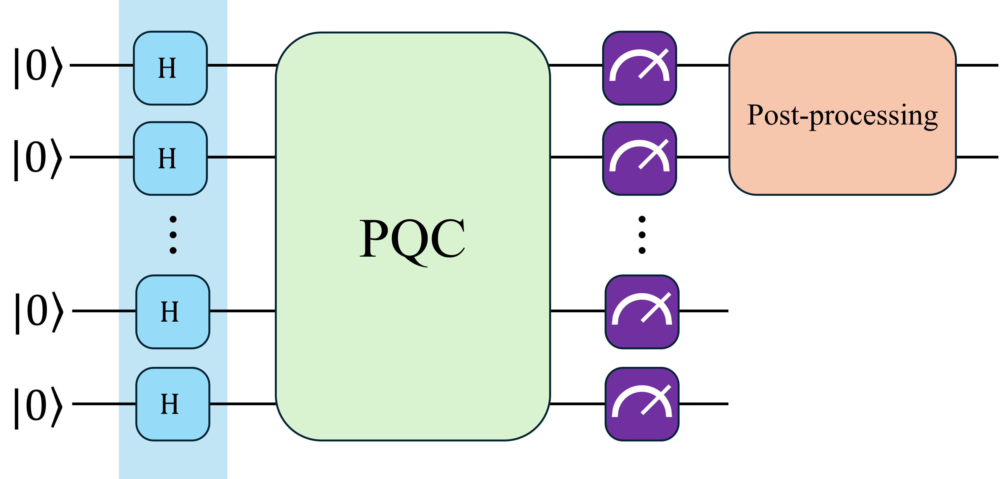

# **Summary of ECAL Channel Test Results**
---

This README file includes a summary of test results for the various parameters explored in my experiments.
Each entry in the table represents a specific configuration and its outcomes. The model used in the training is the proposed by 
[He-Liang et.al.](https://arxiv.org/abs/2010.06201), this model consist in a set of feature qubits which will represent the distribution
and a set of auxiliar qubits which gives the model more freedom, a post-processing is performed over the circuit output, first is divided by
a number $y \in [0, 1]$ which allows the circuit output to take values larger than 1 and fix the limitation of the maximum sum of the output 
probabilities.

- The first 5 test show that a smaller generator lr produces a better convergence, range tested: $gen\,\,lr \in [0.005, 0.4]$.

| id | qubits | auxiliar qubits | circuit depth | generators | rotations | lr gen | lr disc | batch size | resolution | optimizer | samples | epochs | y | FID | RMSE | disc loss | gen loss | notes |
|---|---|---|---|---|---|---|---|---|---|---|---|---|---|---|---|---|---|---|
| 00 | 7 | 2 | 10 | 2 | ['Y'] | 0.005 | 0.1 | 1 | 8x8 | SGD | 512 | 20 | 0.3 | 1.60e-04 | 5.43e-03 | 1.58e+00 | 7.35e-01 | it seems a small gen lr is better |
| 01 | 7 | 2 | 10 | 2 | ['Y'] | 0.01 | 0.1 | 1 | 8x8 | SGD | 512 | 20 | 0.3 | 1.71e-04 | 8.09e-03 | 1.48e+00 | 8.93e-01 | worse performance with larger gen lr |
| 02 | 7 | 2 | 10 | 2 | ['Y'] | 0.02 | 0.1 | 1 | 8x8 | SGD | 512 | 20 | 0.3 | 1.22e-03 | 1.18e-02 | 1.14e+00 | 8.08e-01 | worse performance with larger gen lr |
| 03 | 7 | 2 | 10 | 2 | ['Y'] | 0.03 | 0.1 | 1 | 8x8 | SGD | 512 | 20 | 0.3 | 4.16e-04 | 7.67e-03 | 1.48e+00 | 8.86e-01 | worse performance with larger gen lr |
| 04 | 7 | 2 | 10 | 2 | ['Y'] | 0.04 | 0.1 | 1 | 8x8 | SGD | 512 | 20 | 0.3 | 1.21e-03 | 1.26e-02 | 1.21e+00 | 7.59e-01 | worse performance with larger gen lr |
| 05 | 7 | 2 | 10 | 2 | ['Y'] | 0.0005 | 0.1 | 1 | 8x8 | SGD | 512 | 30 | 0.3 | 1.89e-04 | 6.36e-03 | 1.69e-01 | 2.30e+00 | It seems a very small generator lr is not that good |
| 06 | 7 | 2 | 10 | 2 | ['Y'] | 0.001 | 0.1 | 1 | 8x8 | SGD | 512 | 30 | 0.3 | 2.88e-04 | 6.32e-03 | 5.82e-01 | 1.54e+00 | this test is better than the 05 |
| 07 | 7 | 2 | 10 | 2 | ['Y'] | 0.002 | 0.1 | 1 | 8x8 | SGD | 512 | 30 | 0.3 | 1.88e-04 | 5.40e-03 | 1.27e+00 | 1.21e+00 | this test has a similar perfomance than 06 |
| 08 | 7 | 2 | 10 | 2 | ['Y'] | 0.003 | 0.1 | 1 | 8x8 | SGD | 512 | 30 | 0.3 | 2.99e-04 | 6.15e-03 | 1.47e+00 | 9.73e-01 | this test seems work better than 05, 06, 07 |
| 09 | 7 | 2 | 10 | 2 | ['Y'] | 0.004 | 0.1 | 1 | 8x8 | SGD | 512 | 30 | 0.3 | 2.96e-04 | 6.27e-03 | 1.40e+00 | 1.14e+00 | this test seems work better than 05, 06, 07 |
| 10 | 7 | 2 | 10 | 2 | ['Y'] | 0.004 | 0.05 | 1 | 8x8 | SGD | 512 | 30 | 0.3 | 2.03e-04 | 6.64e-03 | 1.56e+00 | 1.04e+00 | analysis pending |
| 11 | 7 | 2 | 10 | 2 | ['Y'] | 0.004 | 0.01 | 1 | 8x8 | SGD | 512 | 30 | 0.3 | 5.90e-04 | 8.62e-03 | 9.55e-01 | 1.20e+00 | analysis pending |
| 12 | 7 | 2 | 10 | 2 | ['Y'] | 0.004 | 0.005 | 1 | 8x8 | SGD | 512 | 30 | 0.3 | 1.94e-04 | 5.05e-03 | 1.17e+00 | 7.20e-01 | analysis pending |
| 13 | 7 | 2 | 10 | 2 | ['Y'] | 0.004 | 0.2 | 1 | 8x8 | SGD | 512 | 30 | 0.3 | 4.54e-04 | 7.29e-03 | 1.41e+00 | 9.72e-01 | analysis pending |
| 14 | 7 | 2 | 10 | 2 | ['Y'] | 0.004 | 0.3 | 1 | 8x8 | SGD | 512 | 30 | 0.3 | 1.96e-04 | 6.00e-03 | 1.17e+00 | 7.67e-01 | analysis pending |
| 15 | 7 | 2 | 10 | 2 | ['Y'] | 0.005 | 0.1 | 1 | 8x8 | SGD | 1024 | 30 | 0.3 | 5.25e-04 | 8.60e-03 | 4.90e-01 | 1.20e+00 | analysis pending |
| 16 | 7 | 2 | 10 | 2 | ['Y'] | 0.005 | 0.1 | 1 | 8x8 | SGD | 2048 | 30 | 0.3 | 2.94e-04 | 6.13e-03 | 7.21e-01 | 1.27e+00 | analysis pending |
| 17 | 7 | 2 | 10 | 2 | ['Y'] | 0.005 | 0.005 | 1 | 8x8 | SGD | 1024 | 30 | 0.3 | 1.39e-04 | 5.05e-03 | 1.19e+00 | 8.54e-01 | smooth convergence, half of the image almost perfect, worth try more epochs |
| 18 | 7 | 2 | 10 | 2 | ['Y'] | 0.005 | 0.005 | 1 | 8x8 | SGD | 2048 | 30 | 0.3 | 4.65e-04 | 7.58e-03 | 1.31e+00 | 8.12e-01 | analysis pending |
