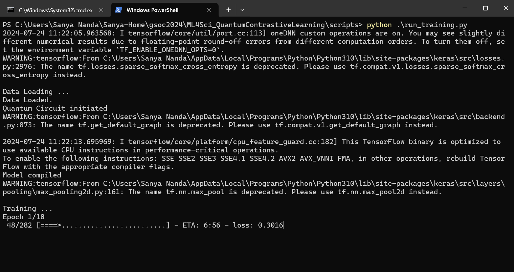

# Quantum Contrastive Learning for High-Energy Physics Analysis at the LHC
## Learning quantum representations of classical high energy physics data with contrastive learning

#### Project Documentation: 
- [Proposal](slides/sanya-ml4sci-proposal.pdf)
- [Test Tasks](https://github.com/SanyaNanda/ML4Sci-QMLHEP-2024)
- [Plan](slides/ML4Sci-QuantumContrastiveLearning.pdf)
- [ML4Sci Project Description](https://ml4sci.org/gsoc/2024/proposal_QMLHEP3.html)
- [GSoC Abstract](https://summerofcode.withgoogle.com/programs/2024/projects/IDScJm9Z)

#### Mid-Term Evaluation:
- [Lightning Talk Presentation](slides/ML4Sci-MidTerm.pdf)
- [Blog](https://medium.com/@sanya.nanda/quantum-contrastive-learning-on-lhc-hep-dataset-1b3084a0b141)

#### Jupyter Notebooks
A comprehensive order to go through the jupyter notebooks
- [Data Visualisation](notebooks/Experiment_MNIST_0_1/1_data_loading_visualization.ipynb)
- [Classical Base Model on MNIST](notebooks/Experiment_MNIST_0_1/2_classical_base_model_mnist.ipynb)
- [Hybrid Base Model on MNIST](notebooks/Experiment_MNIST_0_1/3_hybrid_base_model_mnist.ipynb)
- [Experimentation on electron-photon dataset](notebooks/Experiment_electron_photon)
- [Experimentation on quark-gluon dataset](notebooks/Experiment_quark_gluon)
 
#### Description of Directories and files

- `qssl/`: Main package directory.
  - `__init__.py`: Makes `qssl` a Python package.
  - `data/`: Directory for data-related scripts.
    - `data_loader.py`: Script for loading data.
    - `data_pair_creation.py`: Script for creating data pairs.
    - `data_preprocessing_augmentation.py`: Script for data preprocessing and augmentation.
  - `loss/`: Directory for loss function scripts.
    - `contrastive_pair_loss.py`: Script for contrastive pair loss function.
    - `info_nce.py`: Script for InfoNCE loss function.
  - `models/`: Directory for model definitions.
    - `qcl.py`: Script defining the quantum contrastive learning model.
  - `training/`: Directory for training scripts.
    - `train.py`: Script for training the model.
  - `evaluation/`: Directory for evaluation scripts.
    - `evaluate.py`: Script for evaluating the model.
  - `utils/`: Directory for utility scripts.
    - `helpers.py`: Helper functions.
  - `config.py`: Configuration file for the project.

- `scripts/`: Directory for scripts to run training and evaluation.
  - `run_training.py`: Script to run the training process.
  - `run_evaluation.py`: Script to run the evaluation process.

- `tests/`: Directory for test scripts.
- `notebooks/`: Directory for Jupyter notebooks. [Comprehensive Guide to navigate notebooks](#Jupyter-Notebooks)
- `slides/`: Directory for presentation slides.
- `requirements.txt`: File listing the dependencies.
- `setup.py`: Setup script for the package.
- `README.md`: This file.
- `LICENSE`: License for the project.
- `.gitignore`: Git ignore file.

#### How to Run
- Create a virtualenv
- Pip install the libraries mentioned in requirements.txt
- Try out the jupyter notebooks
- To train the QCL model on quark-gluon dataset run "python scripts/run_training.py"

  

To understand the project in depth refer the [mid-term evaluation blog](https://medium.com/@sanya.nanda/quantum-contrastive-learning-on-lhc-hep-dataset-1b3084a0b141) and summarised results can be found in this [presentation](slides/ML4Sci-MidTerm.pdf).

#### References

[1] M. Andrews, J. Alison, S. An, B. Burkle, S. Gleyzer, M. Narain, M. Paulini, B. Poczos, E. Usai, End-to-end jet classification of quarks and gluons with the CMS Open Data, Nuclear Instruments and Methods in Physics Research Section A: Accelerators, Spectrometers, Detectors and Associated Equipment, Volume 977, 2020, 164304, ISSN 0168–9002,
https://doi.org/10.1016/j.nima.2020.164304.

[2] A. Hammad, Kyoungchul Kong, Myeonghun Park and Soyoung Shim, Quantum Metric Learning for New Physics Searches at the LHC, 2023, https://arxiv.org/pdf/2311.16866

[3] Exploring Siamese Networks for Image Similarity using Contrastive Loss

[4] Jaderberg, B., Anderson, L.W., Xie, W., Albanie, S., Kiffner, M. and Jaksch, D., 2022. Quantum self-supervised learning. Quantum Science and Technology, 7(3), p.035005.

[5] Oh, S., Choi, J. and Kim, J., 2020, October. A tutorial on quantum convolutional neural networks (QCNN). In 2020 International Conference on Information and Communication Technology Convergence (ICTC) (pp. 236–239). IEEE.

[6] Le-Khac, P.H., Healy, G. and Smeaton, A.F., 2020. Contrastive representation learning: A framework and review. Ieee Access, 8, pp.193907–193934.

[7] Jaiswal, A., Babu, A.R., Zadeh, M.Z., Banerjee, D. and Makedon, F., 2020. A survey on contrastive self-supervised learning. Technologies, 9(1), p.2.

[8] Khosla, P., Teterwak, P., Wang, C., Sarna, A., Tian, Y., Isola, P., Maschinot, A., Liu, C. and Krishnan, D., 2020. Supervised contrastive learning. Advances in neural information processing systems, 33, pp.18661–18673.

[9] Wang, T. and Isola, P., 2020, November. Understanding contrastive representation learning through alignment and uniformity on the hypersphere. In International conference on machine learning (pp. 9929–9939). PMLR.

[10] Liu, Y., Jin, M., Pan, S., Zhou, C., Zheng, Y., Xia, F. and Philip, S.Y., 2022. Graph self-supervised learning: A survey. IEEE transactions on knowledge and data engineering, 35(6), pp.5879–5900.
